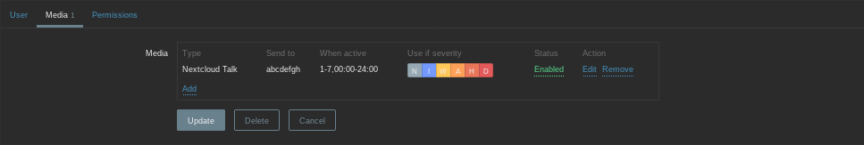
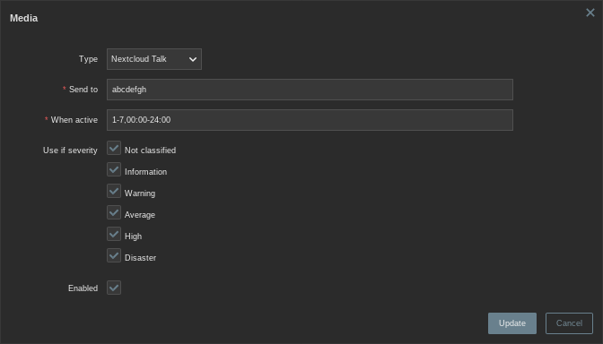
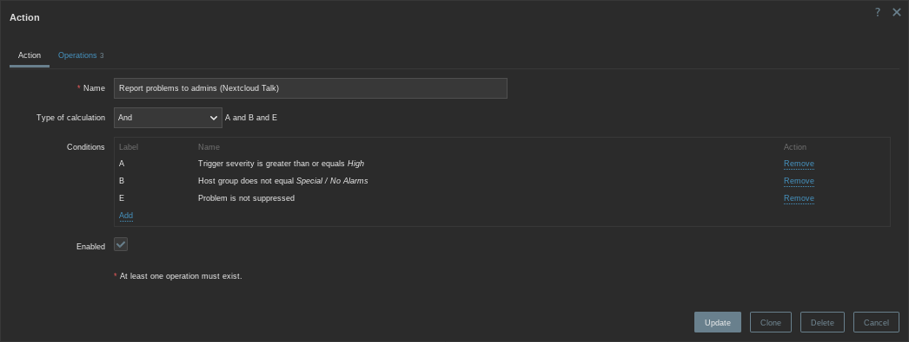
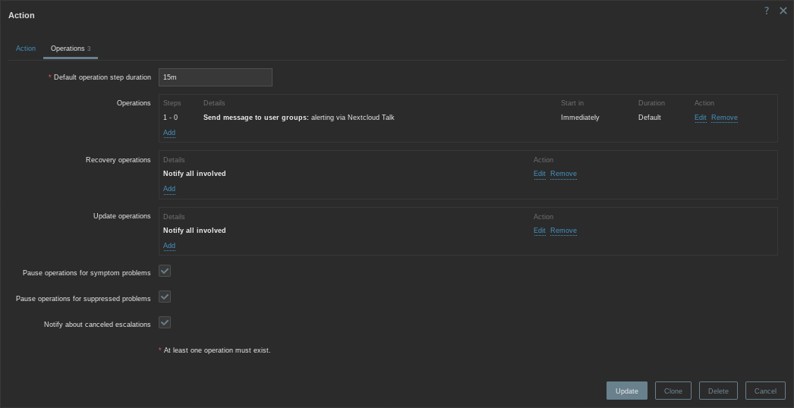
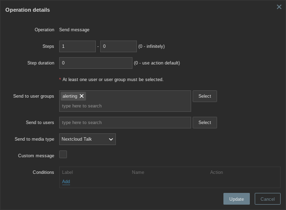

# SYNOPSIS

This is a Zabbix media type to send trigger action messages to Nextcloud Talk (Spreed).

The basic intention is to have notification chat messages for alarms (similar to alarm eMails e.g.), with (optionally) some severity levels posting only silent messages and chat messages being updated to the current alarm state.

# REQUIREMENTS

- Zabbix 7.0+ using `utf8mb4` database charset  
  alternatively you can use Zabbix 6.4 and `utf8mb3` charset by editing the message templates (remove the emoji prefixes in subjects)
- Nextcloud Talk
  - one or more message channel(s)/conversation(s) to post and update notifications in
  - an user/account, having a bearer token, with API access and permissions to post and edit messages in that conversation(s)

# SETUP

## Nextcloud

- create an account to be used (dedicated user for Zabbix, generic bot user, whatever fits your needs)  
  → this is the "sender" of the messages
- create (and note) a new app password for Zabbix in the user's (security) settings
- create one or more channel(s)/conversation(s) for alerts to be posted in  
  → this can be 1:1 conversations with the bot user too
- permit the user to access the channel(s) and drop messages there (`Can post messages and reactions` permission)

## Zabbix

- import the `media_type.yaml` from this repository  
  `Alerts`→`Media types`→`Import`
- configure the now existing `Nextcloud Talk` type
  - set the `auth_token`  
    → your noted app password from above
  - set the `endpoint_host`  
    → your Nextcloud Talk server
  - set the `endpoint_baseurl`  
    → usually `/ocs/v2.php/apps/spreed/api/v1/chat` under your Nextcloud docroot
  - set `silent_nseverities`  
    - set empty if you want all messages to be loud
    - remove angle brackets from the example to get "only `Disaster` alerts are loud and others are silent"
    - set individually [single number or comma separated list of numbers]
  - edit `Message templates` (optional)
  - modify other options as well (optional)
  - make sure that the `Process tags` setting is activated, otherwise message updates won't work
- for every user that should get notified add the `Nextcloud Talk` media with the `Send to` value set to the target conversation ID  
  `Users` → `Users`
  - this can be a personal account or a functional account for alerting e.g. (depending on your Zabbix user arrangement)
  - the conversation ID is the last portion of the URL (e.g. `https://nextcloud.company.org/nc-docroot/index.php/call/abcdefgh` → `abcdefgh`)
  - limit active hours and/or severity levels (optional)
  - example  
      
    
- create one or more trigger action(s) to define all conditions for message sending  
  `Alerts` → `Actions` → `Trigger actions`
  - depending on your alerting concept it might be suitable to simply add the Nextcloud Talk notifications to an existing action  
    but please note:
    - you likely want to have a rather short operation step period here  
      usually you don't want to get annoyed by a new eMail (reminding you that this problem still exists) frequently and therefore might have a step peroid of 30-120 minutes here e.g.  
      however, as this media type only sends a *new* chat message when an event *appears* and then *updates* the same chat message on each operational step you won't feel bugged that way; you simply get updated details in the existing message  
      but don't make this period too small either because this might lead to "acknowledgement messages" or "severity changed messages" not being noticed because they were overridden too fast (before anyone saw them)  
      a value of 15-30 minutes is a recommended step duration
    - make sure you define `Recovery operations` and `Update operations` as they are a part of the message updating process as well (different message templates)
  - example  
      
      
    

# KNOWN QUIRKS

- message updates only work in one channel if multiple ones are used: this is being worked on!
- currently Nextcloud Talk does not allow updating/editing messages older than 24 hours. This leads to missing message updates after that time period and to "message sending failed" notifications in Zabbix.  
  At the moment the only solution is to limit the trigger action operation steps accordingly to not try to send updates afterwards (or you can simply ignore the "failed to send"-state in Zabbix).

# DEVELOPMENT

Development happens on GitHub in the well known way (fork, PR, issue, etc.).  
Feel free to report problems, suggest improvements or drop new ideas.

# ACKNOWLEDGMENTS

- [Zabbix](https://www.zabbix.com/) ([GitHub](https://github.com/zabbix/zabbix))  
  An enterprise-class, open-source distributed monitoring solution.
- [Nextcloud](https://nextcloud.com/) ([GitHub](https://github.com/nextcloud/server))  
  An open-source, self-hosted content collaboration platform.
- [Nextcloud Talk (Spreed)](https://nextcloud.com/talk/) ([GitHub](https://github.com/nextcloud/spreed))  
  A video and audio conferencing app for Nextcloud.
